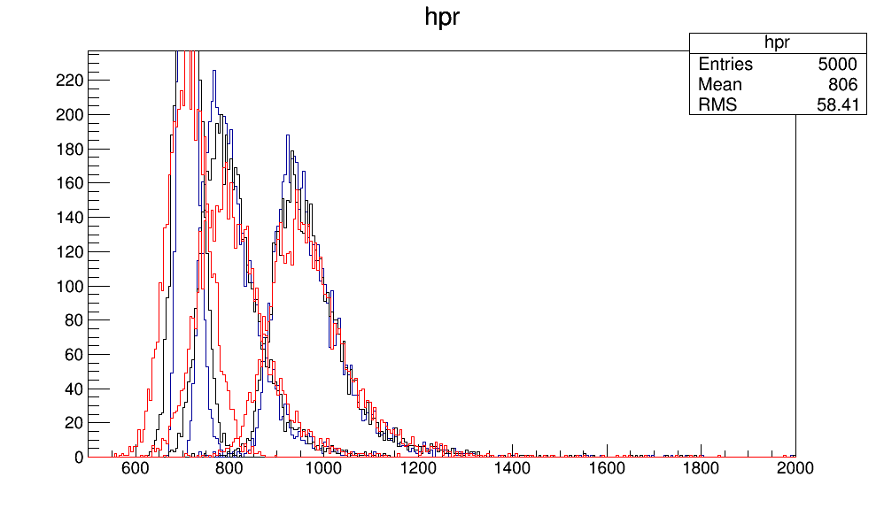
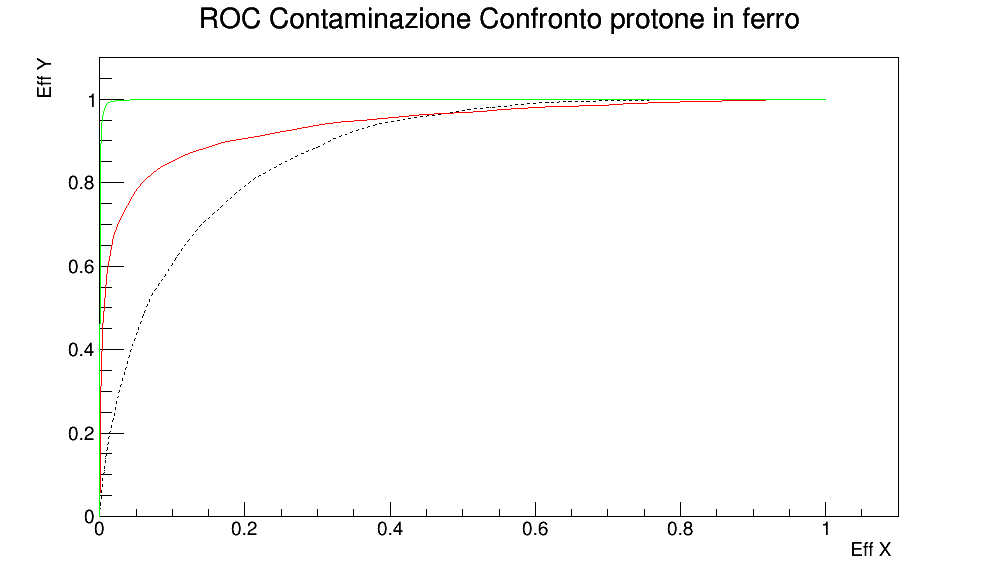

 Using the ROOT framework and data from the Pierre Auger collaboration
 The distribution of that Xmax variable and a new smeared Xmax is created to simulate the resolution of the experiment:

then a ROC curve is built studying the contamination of the distribution of the different xmax values from different rays 

